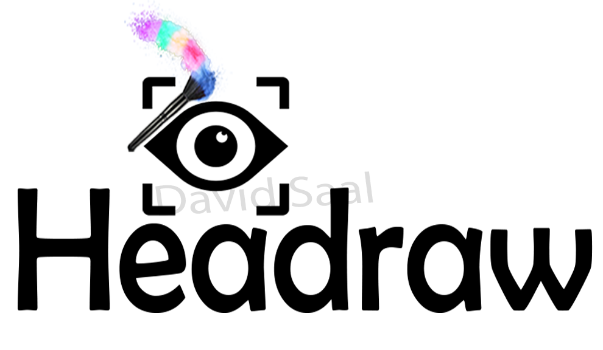
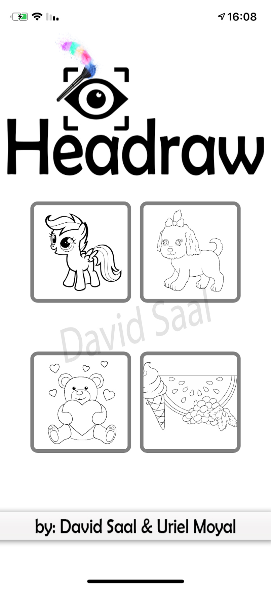

### Introduction
The goal of the project is to create an iOS app for children with motor problems 
that will allow them to paint a coloring book with the front camera of their device 
using gaze focusing technology - a system that allows using head control and gaze recognition (An evolving approach in the field of intelligence the artificial). 
The app is intended for children with motor problems who cannot operate a computer or any assistive technology that works with buttons 
And our app will help them expand their capabilities.

### Work Process
We integrated a drawing app with a library called HeadGazeLib, 
which allows gaze focused with the device's camera and track the movement of the head, 
that enabling coloring of a drawing booklet.

### Screenshots

